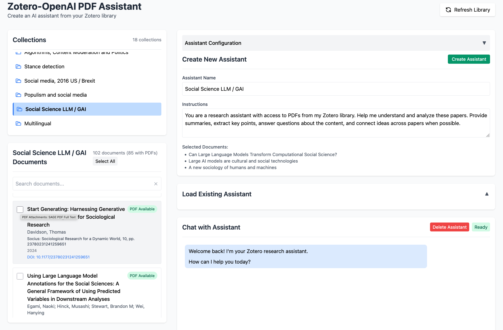

# Zotero-Summarizer

A tool for creating AI assistants from your Zotero library to help analyze and summarize academic papers. This tool allows you to select PDFs from a Collection and create a customized GPT-4o assistant using the files as its knowledge base. The tool then provides a chat interface for interacting with the assistant, as well as the capability to load or delete existing assistants.



## Features

- Connect to your Zotero library and browse collections
- View papers in a collection and check which have available PDFs
- Create AI assistants with selected PDFs and customized instructions
- Load existing assistants you've created previously
- Chat with your assistant about your research papers
- Delete currently loaded assistant
- Toggle between light and dark mode

## Requirements and Warnings

### Zotero Requirements
- **API Access**: Requires a Zotero API key with **READ** access to your library. It cannot make any changes to your library.
- **Cloud Storage**: Assumes all PDFs are stored in Zotero cloud storage
- **Account**: You must have a Zotero account with synced collections

### OpenAI Requirements
- **API Key**: Needs an OpenAI API key with full access to the Assistants API
- **Permissions**: The app will create, load, modify, and delete assistants in your account
- **Cost Warning**: Using this application will incur charges on your OpenAI account, although the fees should be a few cents or less unless a very large number of documents is used.
  - PDF uploads and vector embedding generation cost money
  - Assistant API calls cost money
  - Costs vary based on PDF size and chat usage

## Setup

1. **API Keys**:
   - Create a [Zotero API key](https://www.zotero.org/settings/keys/new) with read access
   - Get your [OpenAI API key](https://platform.openai.com/api-keys) (requires credit card to setup)

2. **Environment Setup**:
   - Clone this repository
   - Create a `.env` file in the main directory with the following variables:
     ```
     OPENAI_API_KEY=your_openai_api_key
     ZOTERO_API_KEY=your_zotero_api_key
     ZOTERO_USER_ID=your_zotero_user_id
     PORT=3000
     ```
   - Install dependencies: `npm install`

## Running the Application


```
npm start
```

This will start at HTTPS server at https://localhost:3000

Visit this address in your browser to begin.


## Security Notes

- Your API keys are stored only in the local `.env` file (not committed to git)
- All communication uses HTTPS encryption
- PDFs are temporarily downloaded to your computer before being sent to OpenAI

## Limitations

- Only works with PDFs stored in Zotero cloud storage
- Cannot process extremely large PDFs (OpenAI has file size limits)
- Quality of assistant responses depends on OpenAI's underlying models

## Created with Claude Code

This application was created using Claude and Claude Code by Anthropic. The intial app was sketched out in a conversation with Claude and the full version was created by Claude Code using $20 of API credits.